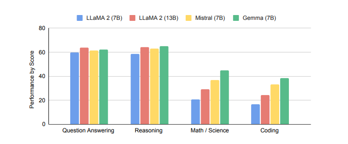
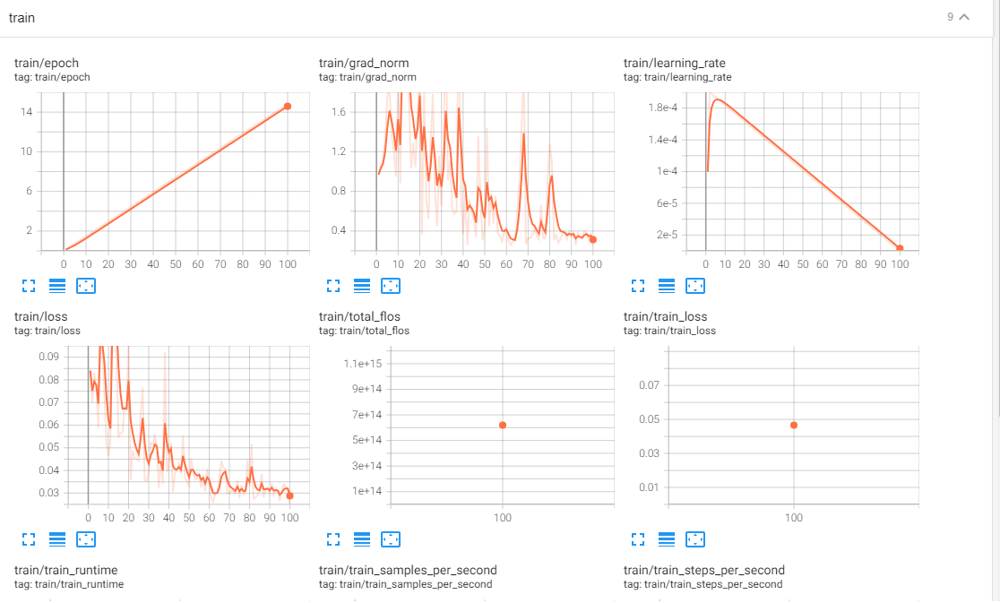
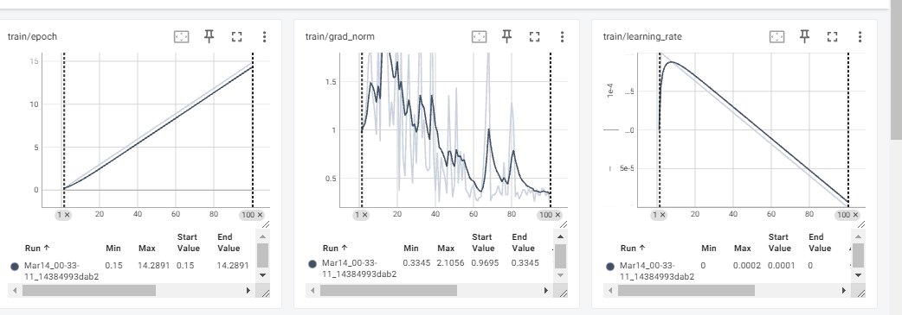

# Customer Support Training Data Analysis

## Overview
This repository contains the code and analysis for performing customer support training data analysis using the Customer Support Training Data available on Kaggle. The analysis aims to gain insights into customer support interactions and improve customer service strategies with the help of open-source LLM model.

## Dataset
The dataset used for this analysis is the [Customer Support Training Data](https://www.kaggle.com/datasets/talaviyabhavik/customer-support-training-data) available on Kaggle. It consists of customer support interactions, including text messages and corresponding labels indicating the category of each interaction.

# Why this Dataset?
- **Real-world Relevance:** Customer support interactions are integral to businesses across industries, making this dataset highly relevant for training and evaluating automated customer service systems.
- **Diverse Query Types:** The dataset covers a wide range of customer queries and requests, including order-related inquiries, cancellation requests, and problem resolutions, providing ample opportunities for system development and testing.
- **Rich Response Variability:** With multiple response options for each query type, the dataset enables the exploration of diverse response strategies and customization approaches tailored to different customer scenarios.
- **Practical Application:** Automated customer service systems trained on this dataset can enhance operational efficiency, improve customer satisfaction, and streamline support processes for businesses.
- **Research:** The research paper introduces LangChain, a custom Large Language Model (LLM), revolutionizing customer service with responsive, context-aware, and personalized interactions, surpassing traditional techniques like FAQs. This custom service chatbot showcases superior performance within various industries, emphasizing its ability to scale and redefine the customer-company relationship, enhancing retention, value, and brand image[1]

### Dataset Details
- **File Format:** CSV
- **Columns:**
- **Flags:** This column contains alphanumeric codes or flags, serving as identifiers or markers for specific attributes or conditions associated with each customer support interaction.

- **Instruction:** The "Instruction" column offers textual descriptions or prompts guiding the response generation process for customer queries or requests. These instructions provide guidelines for crafting appropriate responses tailored to the context and intent of the customer's inquiry.

- **Category:** The "Category" column categorizes each customer query or request into distinct groups based on the nature of the interaction. In this dataset snippet, the primary category is "ORDER," indicating that the queries pertain to order-related issues.

- **Intent:** The "Intent" column specifies the underlying purpose or objective of each customer query or request. In this dataset snippet, the primary intent is "cancel_order," indicating that the customer is seeking assistance with canceling an order.

- **Response:** The "Response" column contains pre-defined textual responses generated by the customer support system in response to each query or request. Crafted based on the category, intent, and specific instructions provided, these responses aim to address customer inquiries effectively and provide relevant assistance. Each response is tailored to the context of the query and intended to guide customers through the resolution process.This dataset is valuable for studying automated customer support systems, exploring natural language processing techniques, and enhancing the efficiency and effectiveness of customer service operations.

## Model Selection: Gemma
For this analysis, we have chosen to use the Gemma model. Gemma has shown better performance compared to other models on similar tasks and possesses a higher token count, making it suitable for handling the complexities and nuances of customer support text data.

### Why Gemma?
- **Performance:** Gemma has demonstrated superior performance in various natural language processing tasks, including text classification and sentiment analysis.
- **High Token Count:** With a higher token count, Gemma can capture more intricate patterns and nuances in the text data, leading to improved performance and accuracy.
- **Robustness:** Gemma's robust architecture ensures stability and reliability, even when dealing with noisy or unstructured text data.
- **Research:** The researcher from Google Gemma dev team shows that it outperforms the Mistral and LLaMA2.

### Why Gemma-2b?
- **Task Complexity:** Gemma-2b may be more suitable for the specific task at hand due to its computational efficiency and lower resource requirements compared to Gemma-7b. For tasks that do not require the immense scale and complexity offered by Gemma-7b, opting for Gemma-2b can provide sufficient performance without excessive computational costs.

- **Resource Constraints**: Gemma-7b requires significantly more computational resources, including GPU memory and training time, compared to Gemma-2b. If there are limitations in available resources such as hardware infrastructure or budget constraints, choosing Gemma-2b allows for more practical implementation and experimentation.

- **Model Complexity:** Gemma-7b is a larger model with more parameters and complexity compared to Gemma-2b. While Gemma-7b may offer higher performance on certain tasks, it also comes with increased computational overhead and potential challenges in fine-tuning and deployment.

- **Overfitting Concerns:** For some tasks, using a smaller model like Gemma-2b may mitigate the risk of overfitting, especially when working with limited data or noisy datasets. Gemma-7b, with its larger capacity, may be more prone to overfitting in such scenarios.

- **Cost-Effectiveness:** Gemma-2b may offer a more cost-effective solution for achieving acceptable performance levels on the task, considering factors such as infrastructure costs, training time, and operational expenses.

## Analysis
The analysis involves preprocessing the text data, training the Gemma model on the labeled customer support interactions, and evaluating its performance on various metrics such as accuracy, precision, recall, and F1-score.

it shows that the loss is continuously dropping so the model is performing well, although the epoch is just 100 times, it can be better with more parameter-tunining.
## Conclusion
The analysis aims to provide valuable insights into customer support interactions and enhance customer service strategies using state-of-the-art natural language processing techniques. By leveraging the Gemma model and conducting a comparative analysis, we can identify the most suitable approach for addressing customer support challenges effectively.

## References:
[1] Pandya, K., & Holia, M. (Year not provided). "Automating Customer Service using LangChain: Building custom open-source GPT Chatbot for organizations." Birla Vishvakarma Mahavidyalaya, Gujarat, India. [Contact: 19me439@bvmengineering.ac.in,msholia@bvmengineering.ac.in]

[2] Reference: Gemma Team, Google DeepMind. "Gemma: Open Models Based on Gemini Research and Technology."
**
